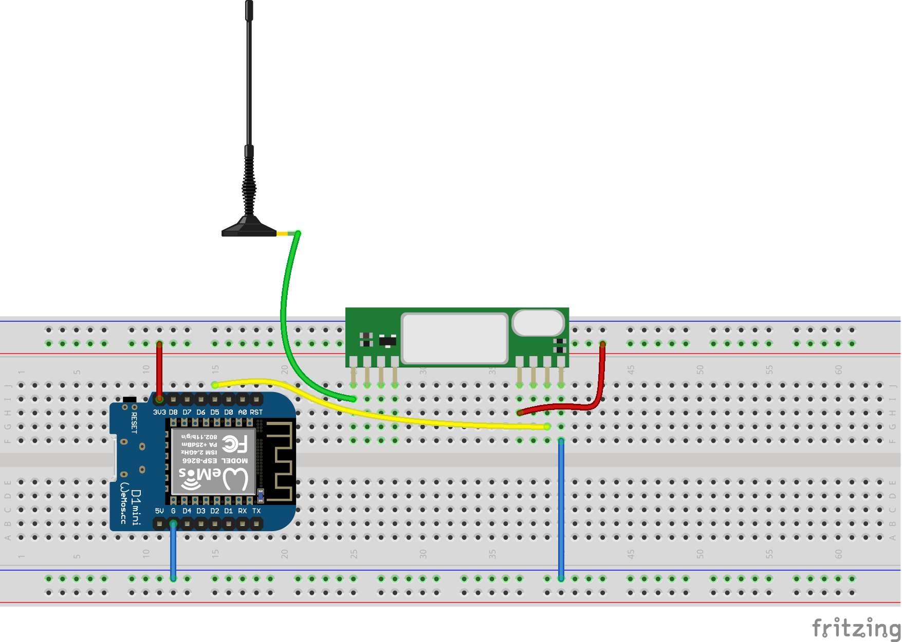
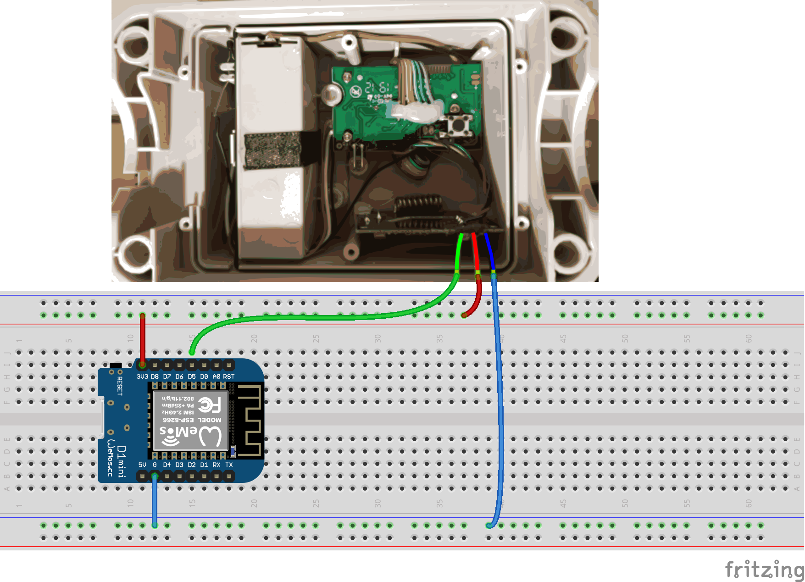
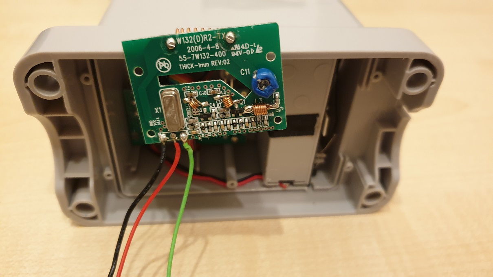

# WeatherStationDataRx

ESPHome external component for receiving 433.92 MHz OOK weather data from the
Ventus W174/W132, Auriol H13726, Hama EWS 1500, and Meteoscan W155/W160 protocol
family. The supported target is ESP32 with the **Arduino framework**, built using
ESPHome's default native ESP-IDF toolchain.

This repository is now an ESPHome component, not a standalone Arduino library.
The RF decoder is bundled in `components/weather_station`; it does not download
or patch a separate library at build time. The migration is tested with ESPHome
2026.9.1, Arduino 3.3.11, and ESP-IDF 5.5.5.

## Use in ESPHome

For a local checkout next to the directory containing your device YAML:

```yaml
esp32:
  board: nodemcu-32s
  framework:
    type: arduino

external_components:
  - source:
      type: local
      path: ../WeatherStationDataRx/components
    components: [weather_station]

sensor:
  - platform: weather_station
    pin: GPIO27
    wind_station_id: 0
    rain_station_id: 0
    temperature:
      name: Temperature
    humidity:
      name: Humidity
    wind_speed:
      name: Wind Speed
    wind_direction:
      name: Wind Direction
    wind_gust:
      name: Wind Gust
    rain_volume:
      name: Rainfall Total
    battery_wind_station:
      name: Wind Station Battery
    battery_rain_station:
      name: Rain Station Battery
```

After publishing these changes to GitHub, the same component can be loaded by Git:

```yaml
external_components:
  - source:
      type: git
      url: https://github.com/BlackSmith/WeatherStationDataRx.git
      ref: master
    components: [weather_station]
```

Pin `ref` to a published commit or tag for reproducible builds. Local changes
are not available through the GitHub URL until they have been committed and pushed.

For the ESPHome Device Builder, the local source directory must exist inside its
filesystem. Copy the repository alongside the YAML directory or use a published
Git source. Paths are relative to the device YAML, not the working directory of
the ESPHome command. A complete YAML and secret template are in
[examples/esphome](examples/esphome/README.md).

## Configuration

- `pin`: internal ESP32 input GPIO connected to the RF receiver's data output.
- `wind_station_id`, `rain_station_id`: transmitter IDs from 0 to 255. The wind
  transmitter also carries temperature and humidity. Set an ID to 0 for scan-only
  logging; scan mode does not publish data from arbitrary nearby transmitters.
- Configure one receiver per device. The Python schema rejects multiple receiver
  instances because the inherited RF buffers are shared.
- Each reading is optional and supports normal ESPHome sensor options such as
  `name`, `id`, `filters` and `force_update`.

| Reading | Default unit | Device class | State class |
| --- | --- | --- | --- |
| `temperature` | °C | temperature | measurement |
| `humidity` | % | humidity | measurement |
| `wind_speed`, `wind_gust` | m/s | wind_speed | measurement |
| `wind_direction` | ° | wind_direction | measurement |
| `rain_volume` | mm | precipitation | total_increasing |
| `battery_wind_station`, `battery_rain_station` | % | battery | measurement |

The RF protocol provides a **low-battery flag**, not a measured percentage.
The numeric battery sensors retain the previous convention: wind 100/0, rain
100/5. These values mean normal/low battery and are not capacity estimates.

## RF protocol and troubleshooting

The [TFD protocol specification v2.0](http://www.tfd.hu/tfdhu/files/wsprotocol/auriol_protocol_v20.pdf)
describes 36-bit LSB-first packets with approximately 9 ms sync intervals,
4 ms logical ones, 2 ms logical zeroes and 0.5 ms active pulses.
The checksum is `(0xF - sum(n0..n7)) & 0xF` for the combined sensor and
`(0x7 + sum(n0..n7)) & 0xF` for the rain gauge.

Temperature is signed in 0.1 °C units, humidity is BCD, wind speed and gust use
0.2 m/s steps, and accumulated rainfall uses 0.25 mm steps. The raw 16-bit rain
counter is converted directly to mm, preserving the full 0–16383.75 mm protocol
range and avoiding the original scaled-integer overflow at 655.5 mm.

The transmitters select random IDs at power-up, so a battery replacement can
change their IDs. DEBUG logs report all decoded packet IDs, including rejected
ones. Every 60 seconds an INFO summary reports GPIO edges, completed frames,
decoded packets and packets matching the configured IDs. Input edges can be noise;
completed frames are not necessarily checksum-valid weather packets.

The combined sensor typically transmits every 31 seconds, with temperature and
humidity only in one of six bursts (about 186 seconds). The rain gauge typically
transmits every 148 seconds. Account for these intervals and any configured
filters before diagnosing a missing reading.

The default repeated-packet policy remains `ARMIgnore`, matching the previously
deployed ESPHome integration. The decoder also retains the v0.5.2 confirmation
policies and ISR/loop buffer coordination. It preserves the existing timing
thresholds and direction validation; values above 360° retain the previous
direction. Native ESP-IDF framework support and multiple receivers are not
implemented.

## Hardware

Reception can use an RXB6/MX-RM-5V receiver or a wired modification to a transmitter.
The original wiring diagrams remain available:







## Tests

The host-side protocol tests require Python 3 and `g++`:

```sh
python3 -m unittest discover -s tests -v
```

The tests replay timed 36-bit frames through the production interrupt handler,
decoder and component publication logic using GPIO and sensor stubs. They cover
signed temperatures, BCD humidity, wind fields, both checksums, the full rain
counter range, independent battery flags, duplicate policies, station ID filters,
scan-only mode, diagnostics counters and interrupt cleanup. Hardware timing and
concurrent interrupt execution still require testing on a physical receiver.
When ESPHome is installed in the Python environment, the suite additionally
validates default HA metadata, scan IDs, ID bounds, framework requirements and
the single-receiver restriction using ESPHome itself.

## Changelog

### Unreleased — ESPHome component migration

- Replace the standalone Arduino library and obsolete custom-sensor example with
  a self-contained ESPHome external component for ESP32/Arduino.
- Carry forward v0.5.2 RF buffer coordination and repeated-packet confirmation
  modes, preserving the deployed `ARMIgnore` policy.
- Correct rainfall overflow and preserve independent low-battery flags.
- Add default HA sensor metadata, scan mode, station ID filtering and RF diagnostics.
- Add timed protocol/publication tests and a complete ESPHome example.

### v0.5.0

- Packet confirmation by duplicates of packets.

## License and attribution

MIT License; see [LICENSE](LICENSE).

The RF decoder is derived from WeatherStationDataRx v0.5.2 commit
`7c82596485d7e3b5d63aeb3af3e7e9ec24a7adc5` by Zwer2k, slartibartfast,
Simone Fardella and Martin Korbel. The ESPHome component replaces its public
Arduino interface while retaining the protocol and receiving behavior.
